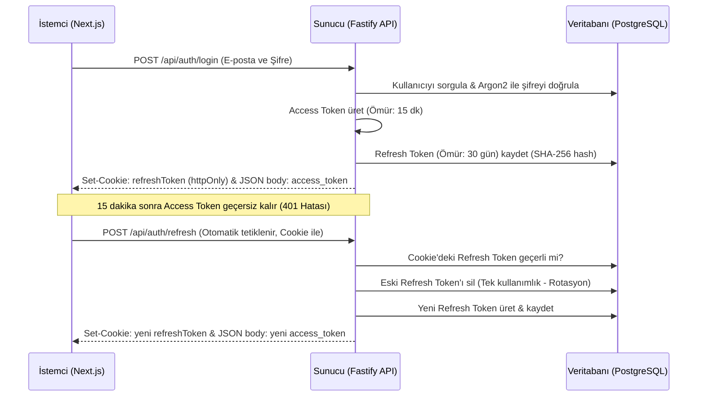

# Tastebook — Mimari ve Geliştirici Kılavuzu (Architecture & Developer Guide)

Bu kılavuz, okulda öğrendiğin teorik bilgileri modern endüstriyel standartlarla birleştirmek ve Tastebook monorepo projesinin tüm yapısını sıfırdan kavrayarak geliştirebilmeni sağlamak için hazırlandı.

---

## 🚀 1. Genel Bakış ve Temel Mimariler

Tastebook; akranlar arasında güvenilir yemek deneyimi paylaşımları ve keşifleri yapılabilmesi amacıyla tasarlanmış bir sosyal ağ platformudur. Klasik harita veya restoran dizinleri yerine, **"Çevremdeki insanların gerçek deneyimlerine dayanarak nerede ve ne yemeliyim?"** sorusuna odaklanır.

Sistem, modern yazılım dünyasında en çok tercih edilen mimari yaklaşımlardan biri olan **Monorepo** yapısıyla tasarlanmıştır.

### Monorepo ve Turborepo Nedir?
* **Monorepo (Tek Depo)**: Birden fazla uygulamayı (Frontend, Backend, Veritabanı tanımları vb.) ayrı ayrı git depolarında tutmak yerine, tek bir git deposu altında birleştiren yaklaşımdır.
* **Neden Tercih Edildi?**: 
  - Frontend ve Backend arasındaki tip tanımlarını (TypeScript interfaces) ve doğrulama kurallarını (Zod schemas) tek bir noktada yazıp her iki tarafta da sıfır kod tekrarı (DRY - Don't Repeat Yourself) ile kullanabilmek için.
  - Bağımlılıkları tek bir komutla yönetebilmek için.
* **pnpm Workspaces**: Bağımlılıkları (node_modules) akıllıca optimize eden ve yerel paketleri (`@tastebook/shared` ve `@tastebook/db` gibi) sanki birer npm paketiymiş gibi yerel olarak birbirine bağlayan araçtır.
* **Turborepo (`turbo`)**: Monorepolarda derleme (build), test ve geliştirme (dev) süreçlerini hızlandıran bir orkestrasyon aracıdır. Değişmeyen kodları önbelleğe alarak (cache) sadece değişen kısımları derler veya test eder.

---

## 🛠️ 2. Kullanılan Teknolojiler, Görevleri ve Avantajları

Sadece Next.js'i az çok tanıdığını belirttin. Endişelenme! Aşağıdaki tabloda projede kullanılan tüm kritik teknolojiler, projedeki rolleri ve sundukları avantajlar açıklanmıştır:

### A. Backend & API Katmanı (`apps/api`)

| Teknoloji | Nedir / Görevi | Neden Kullanıldı & Avantajları |
| :--- | :--- | :--- |
| **Fastify** | Node.js için geliştirilmiş ultra hızlı, düşük overhead'li web çerçevesi (web framework). | Express.js'in modern ve çok daha hızlı bir alternatifidir. Yerleşik plugin (eklenti) sistemi sunar. Express'e kıyasla saniyede çok daha fazla isteği (Request per Second) işleyebilir. |
| **@fastify/jwt & @fastify/cookie** | JWT (JSON Web Token) tabanlı yetkilendirme ve çerez (cookie) yönetimi. | Kullanıcı oturumlarını güvenli ve performanslı bir şekilde yöneter. Çerezleri tarayıcıda `httpOnly` (JavaScript ile erişilemeyen) olarak tutarak XSS saldırılarını engeller. |
| **Argon2** | Şifre özetleme (Password hashing) kütüphanesi. | bcrypt ve SHA-256'ya göre çok daha güvenlidir. Donanımsal saldırılara (GPU/ASIC) karşı dirençli olacak şekilde tasarlanmıştır. OWASP tarafından önerilen altın standarttır. |
| **@fastify/multipart** | Form verisi ve dosya yüklemelerini işlemek için eklenti. | Kullanıcının yüklediği yemek fotoğraflarını (dosya akışlarını) belleği şişirmeden, akış (stream) halinde yakalayıp MinIO'ya aktarmayı sağlar. |
| **ioredis** | Redis önbellek sunucusu ile iletişim kuran Node.js istemcisi. | Ana akış (Feed) gibi yoğun okuma yapılan verileri hızlıca Redis üzerinde önbelleğe alarak PostgreSQL üzerindeki yükü azaltır. |

### B. Frontend / Arayüz Katmanı (`apps/web`)

| Teknoloji | Nedir / Görevi | Neden Kullanıldı & Avantajları |
| :--- | :--- | :--- |
| **Next.js 15 (App Router)** | React tabanlı full-stack web framework. | Dosya tabanlı yönlendirme (file-system routing), Server Components ve Client Components mimarisiyle SEO uyumlu ve hızlı web siteleri sunar. |
| **TanStack React Query (v5)** | İstemci tarafında asenkron veri yönetimi ve önbellekleme (Server-State Management). | API'den gelen verileri tarayıcı hafızasında akıllıca saklar. Veri güncellendiğinde (`mutation`), akışta veya listelerde otomatik yenileme (`query invalidation`) tetikler. Yükleme durumları (`isLoading`), hatalar ve pagination işlemlerini kolayca yönetir. |
| **Zustand** | İstemci tarafında hafif global durum yönetimi (Client-State Management). | Redux'a kıyasla sıfır şablon kod (boilerplate) ile çalışır. Kullanıcının giriş yapıp yapmadığı bilgisini (`isAuthenticated`), kullanıcı profilini (`user`) ve yükleme durumunu tüm sayfalar arasında paylaşır. |
| **Tailwind CSS v4** | CSS sınıfları (Utility-first) yardımıyla hızlı arayüz tasarımı. | Ayrı CSS dosyaları yazmadan HTML/JSX içinde stil vermeyi sağlar. En güncel v4 sürümü, CSS tabanlı `@theme` yapılandırmasını destekler ve performansı en üst seviyeye taşır. |
| **React Hook Form & Zod Resolver** | Form yönetimi ve doğrulama (validation) kütüphanesi. | Formlardaki girdileri (Örn: şifre kuralları, email formatı) anlık kontrol eder. Zod şemaları ile entegre çalışarak geçersiz verilerin sunucuya gönderilmeden engellenmesini sağlar. |

### C. Veritabanı ve Paylaşılan Katman (`packages/*`)

| Teknoloji | Nedir / Görevi | Neden Kullanıldı & Avantajları |
| :--- | :--- | :--- |
| **PostgreSQL** | İlişkisel veritabanı (RDBMS). | Kullanıcılar, takip ilişkileri, yemek gönderileri ve listeler gibi sıkı ilişkisel verileri ACID kurallarına uygun ve güvenilir bir şekilde saklar. |
| **Drizzle ORM** | TypeScript dostu, SQL benzeri yeni nesil ORM. | 9 adet tabloyu TypeScript ile şema olarak tanımlar. Saf TypeScript sorgularıyla SQL yazmayı sağlar. SQL sorgularına çok yakındır, tip güvenliğini (type-safety) en üst düzeyde sağlar. |
| **drizzle-kit** | Veritabanı göç (migration) yönetim aracı. | TypeScript şemasındaki değişiklikleri tarayarak otomatik olarak `.sql` göç dosyaları oluşturur ve bunları veritabanına uygular. |
| **Zod** | TypeScript tabanlı şema tanımlama ve çalışma zamanı doğrulama (runtime validation) kütüphanesi. | Verinin tipini ve kurallarını tanımlar. Hem API isteklerinin doğrulanmasında hem de Frontend formlarında aynı dosya kullanılır. |

---

## 📂 3. Klasör Yapısı ve Dosyaların Görevleri

Projenin kök dizininden başlayarak en ince ayrıntısına kadar klasör ağacı ve bu dosyaların ne işe yaradığı aşağıda açıklanmıştır:

```
tastebook/
├── apps/                               # Ana uygulamalarımız
│   ├── api/                            # Backend (Fastify)
│   └── web/                            # Frontend (Next.js)
├── packages/                           # Paylaşılan kütüphanelerimiz
│   ├── db/                             # Veritabanı tanımları ve Drizzle ORM
│   └── shared/                         # Ortak tipler ve Zod doğrulama şemaları
├── docker-compose.yml                  # Yerel geliştirme için servisler (Postgres, Redis, MinIO)
├── package.json                        # Monorepo bağımlılıkları ve genel scriptler
├── pnpm-workspace.yaml                 # Monorepo içindeki paketlerin yerleşim haritası
└── turbo.json                          # Turborepo görev (task) konfigürasyonu
```

### 1. `packages/db` (Veritabanı Katmanı)
* **`src/schema/`**: Veritabanı tablolarının tasarlandığı yerdir. Her dosya bir veya birden fazla tabloyu ifade eder.
  - `users.ts`: Kullanıcı hesapları (id, username, email, passwordHash vb.).
  - `taste-entries.ts`: Mekan/restoran deneyim değerlendirmeleri (restoran adı, lokasyon, genel puan, alt puanlar, etiketler, görünürlük vb.).
  - `food-items.ts`: Değerlendirme altındaki tekil yemek kalemleri (isim, notlar, sıralama indeksi). `taste_entries` ile 1:N ilişkisi vardır.
  - `entry-media.ts`: Bir gönderiye eklenmiş olan fotoğrafların yolları (S3 URL'leri) ve sıralama indeksleri.
  - `follows.ts`: Takipçi ve takip edilen ilişkileri (sosyal grafik - karşılıklı takip arkadaşlık olarak sayılır).
  - `lists.ts` & `list-items.ts`: Yemek listeleri ve bu listelere eklenen gönderiler.
  - `list-collaborators.ts`: Ortak listeler için işbirlikçiler tablosu (katkıda bulunanlar/editörler).
  - `refresh-tokens.ts`: Oturum yenilemede kullanılan tokenların DB kayıtları.
* **`src/index.ts`**: Veritabanı bağlantı fonksiyonunu (`createDb`) dışa aktarır.
* **`drizzle.config.ts`**: Drizzle Kit aracının şemaları nereden okuyacağını ve göçleri nereye yazacağını belirten konfigürasyon dosyasıdır.
* **`migrations/`**: Drizzle Kit tarafından otomatik oluşturulan `.sql` dosyalarıdır. Veritabanının şema geçmişini tutar.

### 2. `packages/shared` (Ortak Tipler ve Doğrulamalar)
* **`src/schemas/`**: Zod doğrulama şemaları.
  - Örnek: `auth.ts` içinde `registerSchema` bulunur. Bu şema hem **Backend'de** kayıt isteği doğrulamada hem de **Frontend'de** kayıt formundaki TypeScript tiplerini üretmekte kullanılır.
* **`src/api-types/`**: API'nin döneceği standart yanıt formatlarının TypeScript arayüzleridir (`UserResponse`, `EntryResponse`, `ApiResponse` vb.).

### 3. `apps/api` (Backend - Fastify)
* **`src/server.ts`**: Uygulamanın ayağa kalktığı ana giriş noktasıdır. Belirtilen porta (Varsayılan: 3001) dinleyici açar.
* **`src/app.ts`**: Fastify nesnesinin oluşturulduğu, CORS, Cookie, JWT, Multipart gibi temel eklentilerin ve modül rotalarının kaydedildiği yerdir.
* **`src/shared/`**:
  - `plugins/`: Fastify eklentileri (Örn: `db.ts` veritabanı bağlantısını `fastify.db` olarak bağlar; `redis.ts` ve `s3.ts` de benzer şekilde Redis ve S3/MinIO bağlantılarını sağlar).
  - `middleware/`: İstek aralarına giren mekanizmalar. `auth-guard.ts` kullanıcının geçerli bir JWT taşıyıp taşımadığını kontrol eder. `error-handler.ts` ise API'de fırlatılan tüm hataları yakalayıp istemciye düzgün bir JSON yanıtı döner.
* **`src/modules/`**: API'nin modüler iş mantığı parçalarıdır. Her modül kendi içinde bağımsız bir klasördür.
  - **`.routes.ts`**: HTTP isteklerini karşılayan endpoint tanımları (İstek parametrelerini alır, Zod ile doğrular ve `.service.ts` dosyasındaki fonksiyonu çağırır).
  - **`.service.ts`**: İş mantığının (Business Logic) yattığı yerdir. Veritabanı sorguları, şifre doğrulama, dosya kaydetme süreçleri tamamen burada yürütülür.
  - **`.test.ts`**: API'nin doğru çalışıp çalışmadığını test eden entegrasyon testleridir (Vitest ve Supertest kullanır).

### 4. `apps/web` (Frontend - Next.js)
* **`src/app/` (Next.js App Router)**:
  - `layout.tsx`: Tüm sayfalarda ortak olan HTML iskeleti ve yazı tiplerini tanımlar.
  - `providers.tsx`: React Query Provider'ı ve Zustand üzerinden ilk auth kontrolünü (`checkAuth`) çalıştıran sarmalayıcı bileşendir.
  - Route Groups (Parantez içindeki klasörler): Next.js'te URL'de görünmeyen ama sayfaları gruplamayı sağlayan yapılardır.
    - `(auth)`: Giriş (`/login`) ve Kayıt (`/register`) sayfaları ile bunların ortak arka plan tasarımları.
    - `(main)`: Giriş yapmış kullanıcının göreceği ana akış (`/feed`), gönderi ekleme/detay (`/entries`), listeler (`/lists`), arama (`/search`) ve profil (`/profile`) sayfaları ile ana menü tasarımı.
* **`src/components/`**: Yeniden kullanılabilir React bileşenleri. 
  - `ui/`: Butonlar, Inputlar, Dialoglar, Toast mesajları gibi genel bileşenler.
  - Modül bazlı bileşenler: Gönderi kartları (`EntryCard.tsx`), Liste seçiciler, Profil detayları.
* **`src/hooks/`**: TanStack Query kullanan özel hook'lar.
  - Örnek: `use-entries.ts` içinde `useCreateEntry()` adında bir mutasyon hook'u bulunur. Sayfa içinden bu hook çağrılarak gönderi ekleme isteği kolayca tetiklenir.
* **`src/stores/`**: Global durumları tutan Zustand depolarıdır.
  - `auth-store.ts`: Giriş yapmış kullanıcının bilgileri ve çıkış yapma (`logout`) fonksiyonlarını saklar.
* **`src/lib/`**:
  - `api-client.ts`: Tarayıcının yerleşik `fetch` fonksiyonunu sarmalayan, giden isteklere otomatik olarak `Authorization: Bearer <token>` ekleyen ve token süresi bittiğinde sessizce yenileyen (JWT Refresh Flow) akıllı API istemcisidir.

---

## 🔐 4. Kritik Süreçler ve Tasarım Kalıpları

### A. JWT + Rotasyonlu Refresh Token Mekanizması
Güvenli bir kimlik doğrulama için Tastebook iki farklı token kullanır:
1. **Access Token (Erişim Tokenı)**: JWT formatındadır. Kullanıcının kimliğini taşır. Ömrü **15 dakikadır**. Çalınma riskine karşı kısa ömürlü tutulmuştur. Bellekte saklanır.
2. **Refresh Token (Yenileme Tokenı)**: Rastgele üretilen güvenli bir koddur. Ömrü **30 gündür**. Veritabanında SHA-256 özeti tutulur. Tarayıcıda `httpOnly` çerez (cookie) olarak saklanır; böylece kötü niyetli JS kodları bu tokenı çalamaz.

**Oturum Akış Diyagramı:**


### B. Otomatik Token Yenileyen API İstemcisi (`api-client.ts`)
Frontend tarafında `api.fetch()` ile bir istek attığında arkada şu mantık çalışır:
* İstek atılırken başlığa (header) `Authorization: Bearer <accessToken>` eklenir.
* Sunucu **401 Unauthorized** dönerse (yani Access Token'ın süresi bittiğinde):
  1. `api-client.ts` giden istek kuyruğunu durdurur.
  2. Arka planda sessizce `/auth/refresh` endpoint'ine bir POST isteği atar.
  3. Yeni Access Token alınırsa, yarım kalan isteği yeni token ile **tekrar dener**. Kullanıcı bu süreci hiç hissetmez.
  4. Eğer Refresh Token da eskidiyse veya geçersizse, kullanıcıyı otomatik olarak `/login` sayfasına yönlendirir.

### C. Akıllı Akış (Feed) ve Redis Önbellek Yönetimi
Ana sayfadaki akış (Feed) sisteminin performanslı çalışabilmesi için Redis tabanlı bir **versiyonlu önbellekleme** sistemi kurulmuştur:
* Bir kullanıcının ana sayfası oluşturulurken takip ettiği kişilerin gönderileri birleştirilir. Bu birleştirme veritabanı için maliyetlidir.
* Sorgu sonucu Redis üzerinde `feed:<userId>:v<version>:<cursor>` anahtarıyla önbelleğe alınır.
* **Akıllı Geçersiz Kılma (Smart Invalidation)**:
  - Kullanıcı yeni bir gönderi paylaştığında veya birini takip ettiğinde / takipten çıktığında, akış içeriği değişmelidir.
  - Sistem hemen Redis üzerindeki `feed_version:<userId>` değerini **1 artırır** (`redis.incr()`).
  - Bir sonraki istek geldiğinde versiyon değiştiği için eski önbellek anahtarı yerine yeni bir anahtar oluşur ve güncel veri veritabanından çekilip tekrar önbelleğe alınır. Eski önbellekler Redis tarafından zaman aşımıyla temizlenir.

---

## 🛠️ 5. Sıfırdan Yeni Özellik Ekleme Rehberi (Adım Adım)

Diyelim ki uygulamaya **"Yorum Yapma (Comments)"** özelliği eklemek istiyorsun. Bir AI asistanına ihtiyaç duymadan bunu yapmak için şu adımları takip etmelisin:

### Adım 1: Veritabanı Tablosunu Tanımla (`packages/db`)
1. `packages/db/src/schema/comments.ts` adında yeni bir dosya oluştur:
   ```typescript
   import { pgTable, uuid, text, timestamp } from "drizzle-orm/pg-core";
   import { users } from "./users";
   import { tasteEntries } from "./taste-entries";

   export const comments = pgTable("comments", {
     id: uuid("id").primaryKey().defaultRandom(),
     userId: uuid("user_id").references(() => users.id, { onDelete: "cascade" }).notNull(),
     entryId: uuid("entry_id").references(() => tasteEntries.id, { onDelete: "cascade" }).notNull(),
     content: text("content").notNull(),
     createdAt: timestamp("created_at").defaultNow().notNull(),
   });
   ```
2. Bu yeni tabloyu `packages/db/src/schema/index.ts` dosyasına ekle (export et):
   ```typescript
   export * from "./comments";
   ```
3. Terminalde kök dizine giderek yeni SQL göçünü oluştur ve veritabanına uygula:
   ```bash
   npx pnpm db:generate
   npx pnpm db:migrate
   ```

### Adım 2: Paylaşılan Validasyon ve Tipleri Tanımla (`packages/shared`)
1. `packages/shared/src/schemas/comments.ts` dosyasını oluşturup Zod doğrulamalarını ekle:
   ```typescript
   import { z } from "zod";

   export const createCommentSchema = z.object({
     entryId: z.string().uuid(),
     content: z.string().min(1).max(500),
   });

   export type CreateCommentRequest = z.infer<typeof createCommentSchema>;
   ```
2. `packages/shared/src/api-types/index.ts` içine yorum yanıt tipini ekle:
   ```typescript
   export interface CommentResponse {
     id: string;
     user: {
       id: string;
       username: string;
       avatar_url: string | null;
     };
     content: string;
     created_at: string;
   }
   ```
3. Yeni şemaları ilgili `index.ts` dosyalarında dışa aktar (export).

### Adım 3: Backend API Modülüünü Oluştur (`apps/api`)
1. `apps/api/src/modules/comments/` klasörünü oluştur.
2. `comments.service.ts` dosyasında veritabanı işlemlerini yaz:
   ```typescript
   import { createDb, comments, users } from "@tastebook/db";
   import { eq } from "drizzle-orm";
   import type { CreateCommentRequest } from "@tastebook/shared/schemas/comments";

   export class CommentsService {
     constructor(private db: ReturnType<typeof createDb>) {}

     async createComment(userId: string, data: CreateCommentRequest) {
       const [comment] = await this.db.insert(comments).values({
         userId,
         entryId: data.entryId,
         content: data.content
       }).returning();
       return comment;
     }
     
     // Yorumları listeleme fonksiyonu vb.
   }
   ```
3. `comments.routes.ts` dosyasında HTTP rotalarını tanımla:
   ```typescript
   import type { FastifyInstance } from "fastify";
   import { CommentsService } from "./comments.service";
   import { createCommentSchema } from "@tastebook/shared/schemas/comments";
   import { authGuard } from "../../shared/middleware/auth-guard";

   export default async function commentRoutes(fastify: FastifyInstance) {
     const commentsService = new CommentsService(fastify.db);

     fastify.post("/comments", { onRequest: [authGuard] }, async (request, reply) => {
       const body = createCommentSchema.parse(request.body);
       const comment = await commentsService.createComment(request.userId, body);
       return reply.status(201).send({ data: comment });
     });
   }
   ```
4. Yeni rotayı `apps/api/src/app.ts` dosyasına kaydet:
   ```typescript
   import commentRoutes from "./modules/comments/comments.routes";
   // ...
   await app.register(commentRoutes, { prefix: "/api" });
   ```

### Adım 4: Frontend API Hook'unu Yaz (`apps/web`)
1. `apps/web/src/hooks/use-comments.ts` dosyasını oluştur:
   ```typescript
   import { useMutation, useQueryClient } from "@tanstack/react-query";
   import { api } from "../lib/api-client";
   import { CreateCommentRequest } from "@tastebook/shared/schemas/comments";

   export function useCreateComment() {
     const queryClient = useQueryClient();

     return useMutation({
       mutationFn: async (body: CreateCommentRequest) => {
         return api.fetch("/comments", {
           method: "POST",
           body: JSON.stringify(body),
         });
       },
       onSuccess: (_, variables) => {
         // Yorum eklenince gönderi detayındaki yorumları yenile
         queryClient.invalidateQueries({ queryKey: ["comments", variables.entryId] });
       },
     });
   }
   ```

### Adım 5: Arayüze Entegre Et (`apps/web/src/app`)
1. İlgili React bileşeninde (örneğin gönderi kartının altında) formu oluştur:
   ```tsx
   "use client";

   import { useState } from "react";
   import { useCreateComment } from "@/hooks/use-comments";

   export function CommentForm({ entryId }: { entryId: string }) {
     const [content, setContent] = useState("");
     const { mutate: createComment, isPending } = useCreateComment();

     const handleSubmit = (e: React.FormEvent) => {
       e.preventDefault();
       if (!content.trim()) return;
       createComment({ entryId, content }, {
         onSuccess: () => setContent("")
       });
     };

     return (
       <form onSubmit={handleSubmit} className="flex gap-2 mt-4">
         <input 
           type="text" 
           value={content} 
           onChange={e => setContent(e.target.value)}
           placeholder="Yorum yaz..."
           className="border p-2 rounded flex-1"
         />
         <button type="submit" disabled={isPending} className="bg-primary-500 text-white p-2 rounded">
           Gönder
         </button>
       </form>
     );
   }
   ```

---

## 💡 6. Önemli İpuçları ve Hata Giderme

### 1. Yerel Altyapı Çalışmıyorsa
Eğer veritabanına bağlanılamıyor veya dosya yüklenemiyorsa, Docker konteynerlerinin durumunu kontrol et:
```bash
docker compose ps
```
Eğer durmuş konteyner varsa tekrar başlat:
```bash
docker compose up -d
```

### 2. TypeScript Hataları Alıyorsan
Monorepolarda bazen paylaşılan paketlerin tipleri VS Code tarafından anlık olarak yakalanamayabilir. Terminalde şu komutla tüm projede TypeScript tip kontrolü yapabilirsin:
```bash
npx pnpm typecheck
```
Eğer editörde kırmızı çizgiler gitmiyorsa VS Code'da `Ctrl+Shift+P` tuşlarına basıp **"TypeScript: Restart TS Server"** komutunu çalıştırabilirsin.

### 3. Yeni Migrations Çakışmaları
Takım çalışması yaparken veya yerel veritabanın bozulduğunda, veritabanını tamamen temizleyip sıfırdan oluşturmak için:
```bash
docker compose down -v # Tüm hacimleri (volume) siler
docker compose up -d
npx pnpm db:migrate
```

### 4. Hibrit Canlı (Hybrid Cloud) Ortam ve Ngrok CORS Ayarları
Uygulamayı Vercel'deki frontend üzerinden yerel (ev) sunucudaki API'ye bağlarken şu önemli noktalara dikkat edilmelidir:
- **Tünel Tıkanıklığını Aşma (Browser Warning Bypass):** Ngrok'un ücretsiz tünellerinde ilk girişte gösterilen interstitial (tarayıcı uyarısı) sayfasını atlamak için, giden tüm isteklerde `ngrok-skip-browser-warning: true` header bilgisi gönderilmelidir. Bu yapılandırma `apps/web/src/lib/api-client.ts` içinde yer almaktadır.
- **Backend CORS İzinleri:** API sunucusu CORS preflight isteklerinde bu özel başlığa izin vermelidir. Bu yüzden `apps/api/src/app.ts` dosyasındaki `@fastify/cors` konfigürasyonunda `allowedHeaders` dizisinde `"ngrok-skip-browser-warning"` mutlaka eklenmiş olmalıdır.
- **tmux ile 7/24 Kesintisiz Tünel:** Ev sunucusundaki ngrok tünel bağlantısının SSH kesildiğinde kapanmaması için `tastebook-tuneller` isimli bir `tmux` oturumu kullanılarak arka planda tünel ve izleme servisleri (`glances`, `multitail`) sürekli çalışır halde tutulmaktadır.

